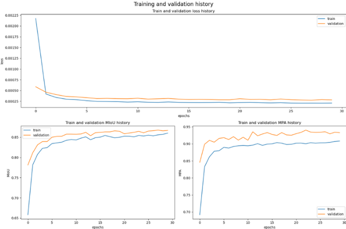

# Real-Time Semantic Segmentation of Fire Using Deep Learning

This project is focused on creating a fire detection model to enhance rescue efficiency with improved accuracy and speed, aiming for real-time processing.

**Project inspired by**: [real-time-fire-segmentation-deep-learning](https://github.com/maidacundo/real-time-fire-segmentation-deep-learning)

Our goal was to reproduce the experiment results and test the model on random YouTube videos to evaluate accuracy.

  
**Result 1**

  
**Result 2 - Random CC TV Accident video *

## Model Architecture
The encoder consists of a DCNN with 16 convolution layers and an ASPP module (Atrous Spatial Pyramid Pooling). The activation function is a combination of both ReLU and HardSwish. The Lion optimizer and Focal Loss are used.

## Results

Loss, MPA [Mean Pixel Average], and MIoU [Mean Intersection over Union] recorder after every epoch

## How to Use the Code

1. Clone the repository.
2. Download the dataset files "Images for fire segmentation" and "Masks annotation for fire segmentation" from [IEEE Dataport](https://ieee-dataport.org/open-access/flame-dataset-aerial-imagery-pile-burn-detection-using-drones-uavs) and move them to the 'data' folder.
3. Follow the instructions in the `main.ipynb` file.
